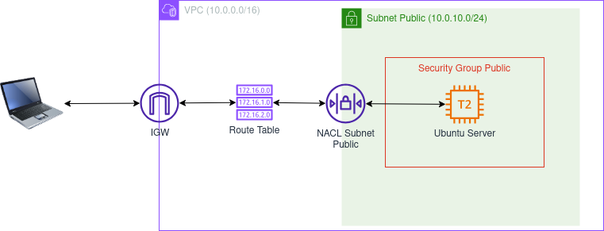

# Terraform AWS Test Environment: Insecure SSH Configuration
The [main.tf](./main.tf) Terraform script creates the resources for an AWS test environment with an insecure SSH configuration. The resources created by the script can be used to test the Python scripts in [this repository](..), which facilitate finding, deleting, and updating insecure AWS resources.

The architectural diagram below shows the AWS resources created by the script.



Before launching the script, review the resources that will be created, as the EC2 instance may incur charges depending on plan type. Please refer to the [Amazon VPC Pricing](https://aws.amazon.com/vpc/pricing/) page for specific regional pricing.  

## Script Overview
The [main.tf](./main.tf) script creates the AWS resources listed below.

+ Virtual Private Cloud
+ Internet Gateway (IGW)
+ Public Subnet
+ Custom Route Table
+ Security Group
+ Network Access Control List (NACL)
+ Key Pair for SSH Access
+ EC2 Instance 

### Security Group Configuration
The Security Group is configured with the rules below, which allow SSH (port 22) ingress traffic. Because security groups are stateful, no corresponding outbound rule is required.

|Type|Protocol|Port Range|Source/Destination|
|----|--------|----------|------------------|
|Inbound|TCP|22|0.0.0.0/0|

### NACL Configuration
The NACL is configured with the rules below, which allow SSH (port 22) traffic. Due to the stateless nature of NACLs, both inbound and outbound rules are required.

|Type|Rule Number|Protocol|Port Range|Source/Destination|Allow/Deny|
|----|-----------|--------|----------|------------------|----------|
|Inbound|100|TCP|22|0.0.0.0/0|Allow|
|Outbound|100|TCP|1024-65535|0.0.0.0/0|Allow|

### Key Pair Configuration
To access the EC2 instance, the public key of an SSH key pair must uploaded to AWS and attached to the instance. Although an existing key pair can be used, the usage instructions below provide the steps to create a new Ed25519 key pair with a name and location that matches the path in the Terraform script.

### Amazon Machine Images: [datasources.tf](./datasources.tf)
As currently configured, `main.tf` creates an EC2 instance from the Ubuntu 22.04 Amazon Machine Image (AMI). The `datasources.tf` file includes `aws_ami` definitions for other AMIs, specifically Amazon Linux 2 and Amazon Linux 2023. To change the AMI, modify the `ami` argument of the `aws_instance.instance` resource in `main.tf` to reference a different data source name. The following AMIs are defined in `datasources.tf`.

|AWS AMI|Data Source Name|
|-------|----------------|
|Ubuntu 22.04|ubuntu-22|
|Amazon Linux 2|amazon-linux-2|
|Amazon Linux 2023|amazon-linux-2023|

## Getting Started

### Dependencies

+ Terraform (For installation instructions, [click here](https://developer.hashicorp.com/terraform/tutorials/aws-get-started/install-cli).)
+ AWS CLI (For installation instructions, [click here](https://docs.aws.amazon.com/cli/latest/userguide/getting-started-install.html).)
+ Established connection to an AWS account

### Installation
To install the script, either clone the [python-aws-scripts](..) repo or download the files in the [terraform-aws-test-env](.) folder to the local host. 

## Usage

### Create the SSH Key Pair
On standard Linux distributions with OpenSSH installed, the command below will create an SSH key pair of type Ed25519 (-t ed25519) in the location (-f ~/.ssh/aws-test-env-ed25519) referenced in `main.tf`. To use a different key type or location, the script must be updated accordingly.

```bash
ssh-keygen -f ~/.ssh/aws-test-env-ed25519 -t ed25519
```

> **NOTE:** The command above should also work for Windows and macOS implementations of OpenSSH.

### Run the Terraform Script
To run the script, follow standard Terraform practices by navigating to the directory that holds the `main.tf` script, then running the commands to initialize and apply the script:

```bash
terraform init
terraform validate
terraform plan
terraform apply -auto-approve
```

### Access the EC2 Instance via SSH
To access the Ubuntu 22.04 EC2 instance, enter the command below in the shell. Change the username to `ec2-user` if using an Amazon Liunux AMI. The IP address of the EC2 instance is displayed as an output of the Terraform script.

```bash
ssh -i ~/.ssh/aws-test-env-ed25519 ubuntu@[instance-ip]
```

## License
Licensed under the [GNU General Public License v3.0](../LICENSE).
